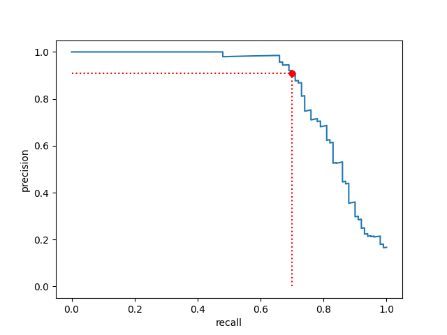
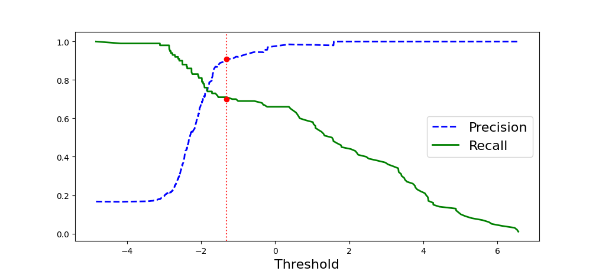

# first_spam_filter
create a machine learning algorithm that classify an mail as spam or not spam.
# project goal
the main purpose of this project is to prectice with the creation of a pipeline capable of turn raw messy data into useful variables to train the model and make predictions
# Dataset
the dataset used for this project is the apache spamassassin public dataset, you can inspect the available datasets and the metadata at the following link: [spamassassin](https://spamassassin.apache.org/old/publiccorpus/)

the sets used for this project are:
- easy_ham: 2500 non-spam messages.  These are typically quite easy to differentiate from spam, since they frequently do not contain any spammish signatures (like HTML etc).

- spam: 500 spam messages, all received from non-spam-trap sources.

the total spam ratio is 1/6
# final model
the final model is a logistic regression model, with a threshold of -1.72, i've chosen it trying to find the best balance between recall and precision, giving to precision the priority, getting a precision rate of 90% and a recall reta of 70%

  
  

